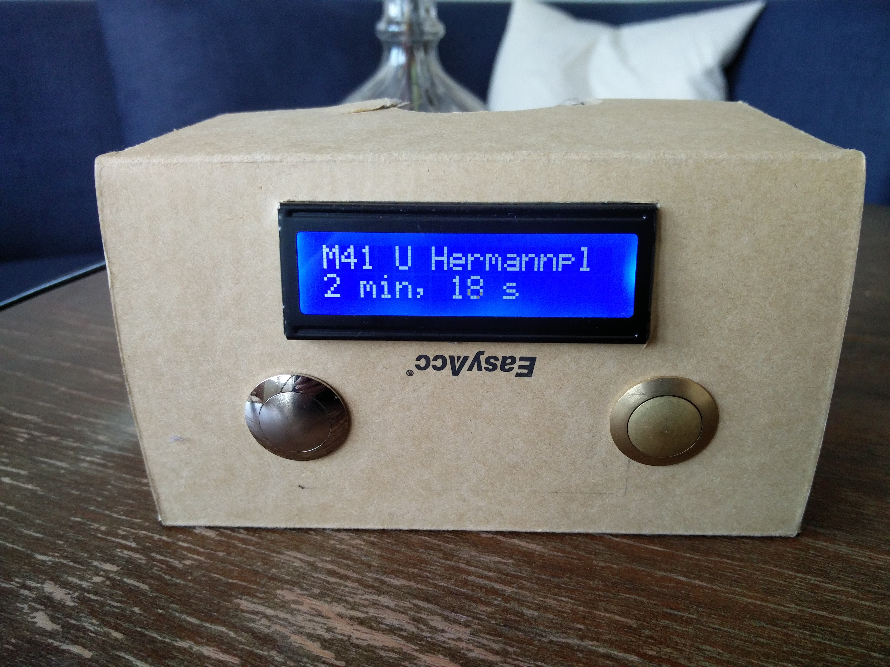
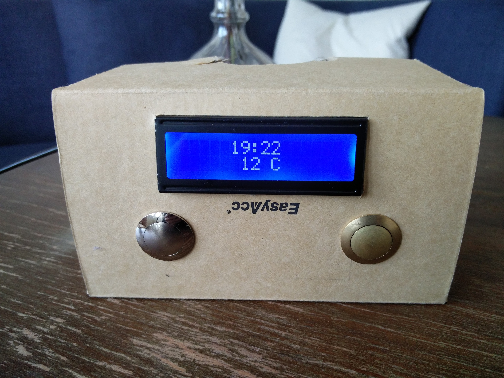
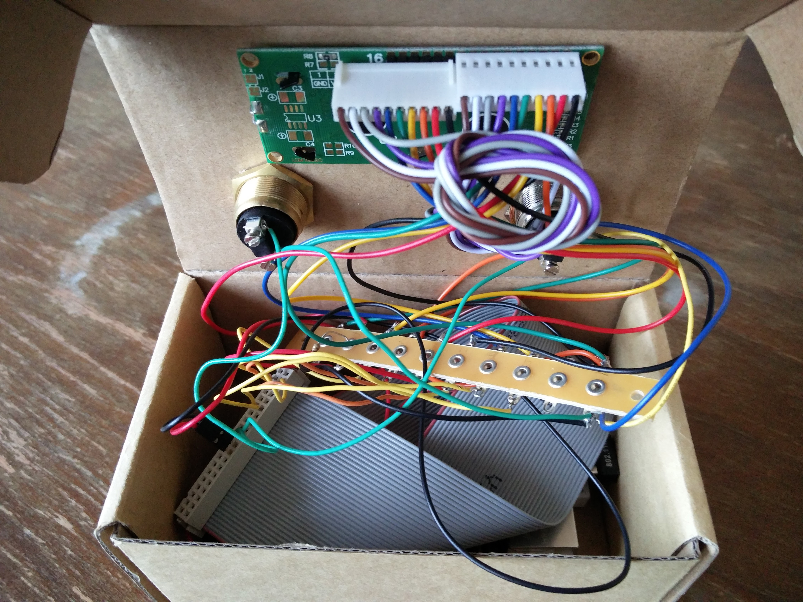
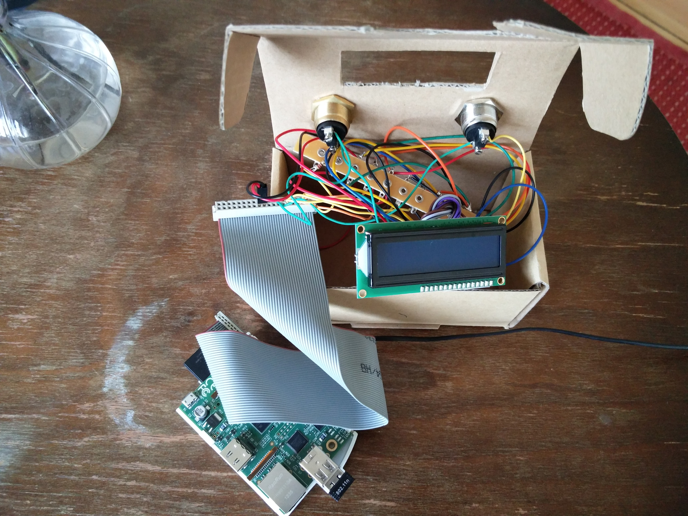
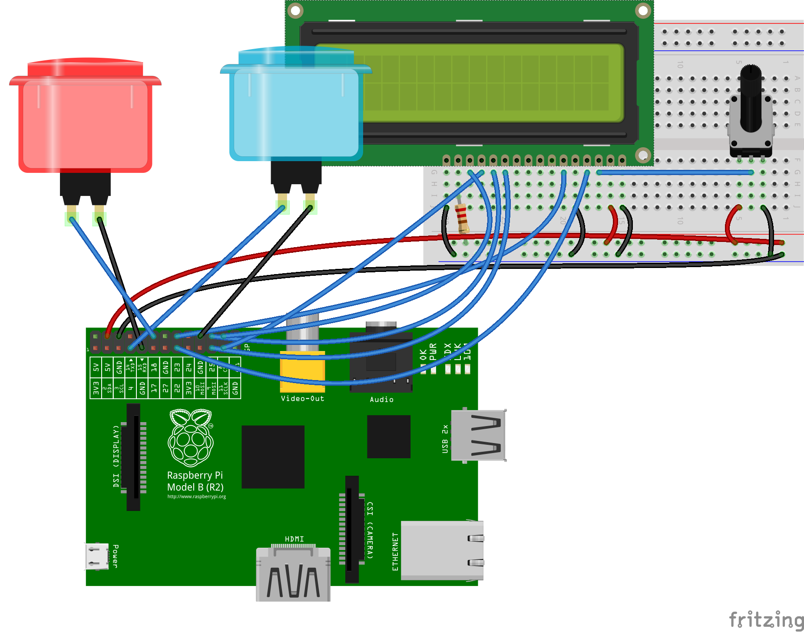
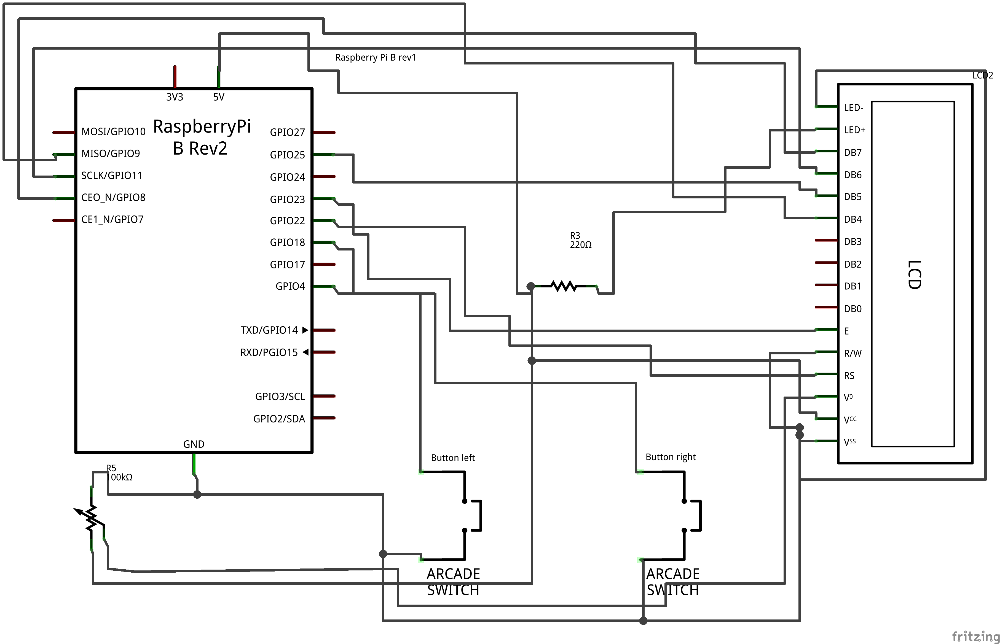

# Public Transport Notifier

Shows the public transport departures for a given station in a little box in your bathroom.

Use the buttons to navigate through the next departures.

## Schemas

## Script for RasberryPi

$ pip install requirements.txt  
$ python3 [run.py](run.py)

In order to see temperature, you need to set a value for `OPEN_WEATHER_API_KEY` variable.

This application uses the following APIs:
* for public transports https://github.com/vied12/bvg-api/tree/real-time  
* for meteo: http://openweathermap.org/api
